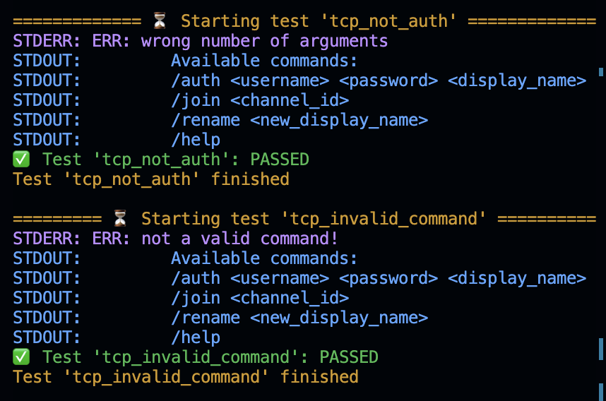

# IPK-01 Testing Server

Author: **Tomáš Hobza** ([xhobza03](mailto:xhobza03@vutbr.cz)) @ FIT VUT 2024

Co-Author IPK25: **Malashchuk Vladyslav** @ FIT VUT 2025

# Warning

I updated IPK24->IPK25 and passed all tests. But made it in 30 min, so it can have troubles.

I have : ✅ 58/58 test cases passed

**Since it is your application, you should also be the author of test sets (i.e., avoid using someone else's tests).**

If you add them to the documentation, do not try to pass them off as your own. Clearly indicate that you are not the author, add a quote, indicate that the tests are not the main ones and are considered only as part of self-checking and do not indicate the correct operation of the application. These tests cannot be part of your testing! You can indicate that you tried them for self-checking and do not consider them part of testing.

Use these tests, but do not expect that even passing them will give you the maximum score during the assessment.

These tests should not be considered in any case as the only ones, you can test at your own discretion using these tests. They do not cover all possible options! They do not check for exact compliance with the rules. The test mainly checks the basic things. You can only count on the fact that all tests will pass, your application meets the basic functionality, but this does not mean that when assessing the project you will receive the maximum score or all the tests will pass there.

These tests are openly available, they are not a reference for writing your own tests and writing your project. They can only be used as an additional validation / check of the project before submitting your project.

All tests described here are fiction of the author and are not real. Any coincidence with reality is a myth.
# If you want to include test results in your IPK documentation made by tests from this repository. I advise you to include clearly indicate that you are not the author and leave a link to this git repository.

Example:

 ...
 
testy [4]

...

[4] MALASHCHUK Vladyslav, Tomáš HOBZA, et al. VUT_IPK_CLIENT_TESTS [online]. GitHub, 2025 [cit. 2025-04-16]. Available at: https://github.com/Vlad6422/VUT_IPK_CLIENT_TESTS

## 📚 Info

Testing server for testing the TCP/UDP messaging client for the IPK project 2025 written in Python. Feel free to use it and modify it however you want.

> ⚠️ I am not an expert in communications nor Python so go on with caution. Any problems that you might find you can hit me up (email/discord) or create a PR.

## 🔄 Usage

The specific usage can be listed with the `-h` flag, but here's probably the most important stuff:

- `<path_to_executable>` - provide the path to the client executable
- `-p <udp|tcp>` - choose the tested protocol (default is both)
- `-d` - will show both `stdout` and `stdin` of the running client
- `-t <testcase_name>` - run a specific test case only

## Run example (For lazy)
- `git clone https://github.com/Vlad6422/VUT_IPK_CLIENT_TESTS.git`
- `cd VUT_IPK_CLIENT_TESTS/`
- `pip3 install termcolor`
- `python3 testo.py ./ipk25chat-client` <- `ipk25chat-client` is your binary file in same directory with testo.py, or path to binary.

## 🛠️ Prerequisites

You might need to install `termcolor` if you don't have it yet using `pip3 install termcolor`.

## ⚖️ License

See [LICENSE](LICENSE).

