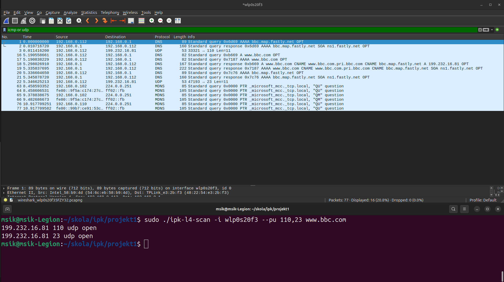
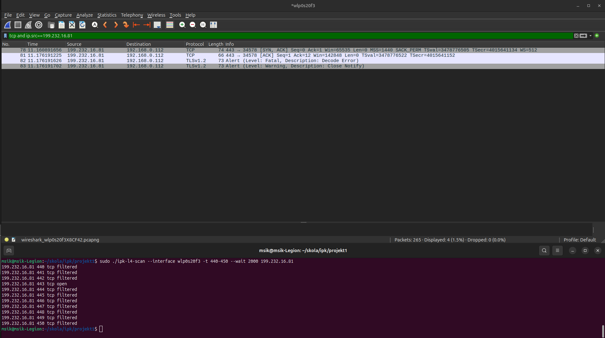
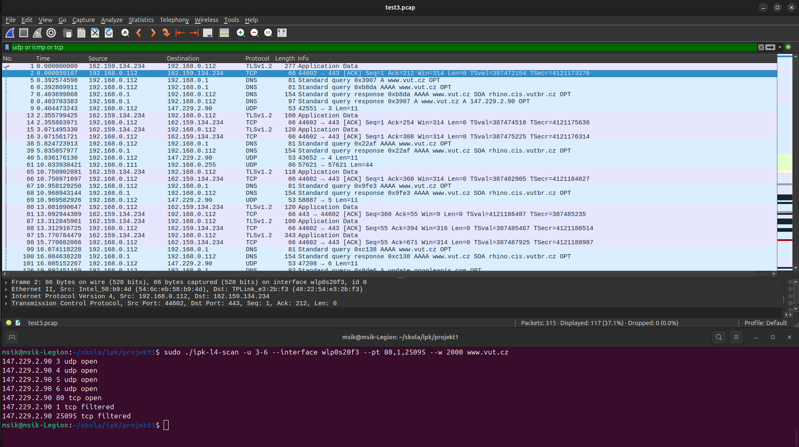
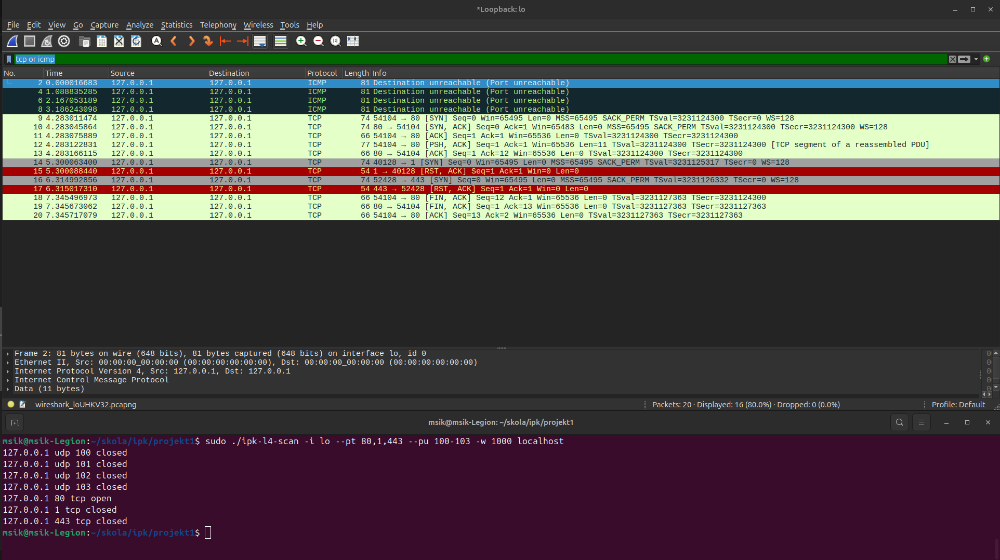

# Dokumentácia 1. projektu IPK
- autor: Juraj Mesík
- login: xmesikj00
- varianta: Omega

## Úvod
Program podľa zadaných argumentov príkazových riadkov skenuje zadané UDP alebo TCP porty. Užívateľ zadáva argumenty v ľubovoľnom poradí, pričom musia obsahovať `-i` alebo `--interface` pre špecifikáciu rozhrania, `--pu` alebo `-u` alebo `-t` alebo `--pt` pre špecifikáciu portov pre skenovanie, nepovinný argument `-w` alebo `--wait` pre určenie časového rozsahu a IP adresu alebo doménovú adresu zariadenia, ktorého porty sa budú skenovať. Pre podrobnejší popis a príklady použitia viď.  [CHANGELOG](./CHANGELOG.md).

## Architektúra
Program sa skladá z troch zdrojových súborov:
- `ipk-l4-scan.c`  obsahuje funkciu `main` a, ktorá spracúvava argumenty príkazového riadku a volá príslušné funkcie pre priradenie hodnôt argumentov a samotné skenovanie
- `utils.c`  obsahuje pomocné funkcie pre manipuláciu s argumentami a jednoduchú funkciu pre posielanie packetu a funkciu pre spracovanie odpovede
- `scanners.c`   obsahuje funkcie zodpovedné za samotné skenovanie, každá z nich prechádza v cykle špecifikované porty, posiela na zadanú adresu relevantné packety a spracúvava odpovede 

a dvoch hlavičkových súborov:
- `utils.h`
- `scanners.h`
, ktoré obsahujú všetky potrebné knižnice pre správne fungovanie programu

## Implementácia
Po načítaní portov sa z funkcie `main` zavolajú funkcie `tcpScan()` a `udpScan()`. Tieto funkcie dostávajú ako parametre:
- `char *interface`  reťazec ktorý má hodnotu použitého rozhrania
- `long tcp_ports[]`  alebo `long udp_ports` tieto polia obsahujú číselné hodnoty portov, ktoré sa budú skenovať
- `char *dst_address`  reťazec, ktorý má hodnotu adresy cieľového zariadenia
- `char errbuf[]`  error buffer určený pre ukladanie a vypisovanie chybových hlásení v prípade zlyhania niektorých funkcii
- `pcap_t *response`  štruktúru, ktorá umožňuje otvorenie sieťového rozhrania, a teda zachytávanie packetov na zadaný čas
- `int timeout`  časové rozmedzie otvorenia sieťového rozhrania na zachytávanie packetov

funckie obsahujú cyklus, ktorý prechádza pole portov a každý zvlášť spracúvava. Každá iterácia teda obsahuje otvorenie rozhrania, načítanie informácií o adrese cieľového zariadenia, špecifikáciu adresy socketu, následne konverziu aktuálneho portu do štruktúry tejto adresy, načítanie adresy cieľového zariadania do formy reťazca, vytvorenie správneho socketu, spárovanie socketu so zadaným rozhraním a nakoniec odoslanie packetu a zachytávanie odpovedí. 

Odosielanie packetov som implementoval vo funkcii `sendPacket()`, ktorá do dostáva parametre, ktoré sú potrebné na zavolanie funkcie `sendto()`:
- `int socket` číselná hodnota vytvoreného socketu
- `char *packet_message` reťazec obsahujúci správu packetu (v implementácii nemá využitie)
- `struct sockaddr *dest` ukazateľ na addresu socketu
- `int ip_version` číselná hodnota, kde 1 znamená, že sa jedna o IPv6 adresu, inak IPv4 

Prijímanie a spracovávanie packetov je implementované vo funkcii `processPacket()` ktorej parametre sú:
- `pcap_t *response`  sieťové rozhranie, cez ktoré prebieha všetká komunikácia 
- `char *ip_str`  reťazec adresy cieľového zariadenia
- `int port_number`  číselná hodnota aktuálne spracovávaného portu
- `int protocol`  číselná hodnota protokolu odosielaných packetov

Táto funkcia okrem samotného zachytávania pomocou `pcap_next_ex()` aj vytvára filter, ktorý na základe parametru `int protocol` vytvorí reťazec na filtráciu prichádzajúcich packetov a vloží ho do `char filter_exp` bufferu deklarovaného na začiatku funkcie. Tento reťazec je neskôr parametrom pre funckiu `pcap_compile()`. Pri UDP packetoch som filter nastavil, aby prepúšťal iba packety protokolov ICMP alebo UDP. Pri TCP filter prepúšťa iba TCP packety, kde odosielateľ musí byť cieľová adresa (parameter `ip_str`) a zdrojový port musí byť aktuálne spracovávaný port (parameter `int port_number`) - tento filter zachytí odpoveď zo správneho zdroja a zo správneho portu.

Kým pri skenovaní UDP portov, program jednoducho posiela packet a čaká na odpoveď, TCP skenovanie obsahuje kroky navyše. Pri TCP som sa rozhodol neposielať packety zo socketu typu `RAW_SOCK` kedy by som musel "manuálne" vytvárať SYN packet a ten následne poslať, ale zvolil som typ `SOCK_STREAM`, a teda je potrebné pred posielaním SYN packetov nadviazať spojenie - na to som použil funkciu `connect()` , ktorá nadviaže spojenie medzi socketom klienta a serverom. Okrem toho potrebujem zachytávať čas "čakania" na odpoveď, nakoľko sa od toho odvíja stav daného portu, a preto pred volaním `connect()` definujem štruktúry `struct timeval start, end;` a nastavím socket tak aby neblokoval žiadnu komunikáciu - tým docielim presnejší výsledok merania času. Ak je pripojenie úspešné okamžite, socket nastavím späť na predvolené blokovanie a odosielam packet. V prípade, že funkcia `connect()` vráti výsledok, ktorý indikuje, že sa na spojenie nejaký čas čaká (`errno == EINPROGRESS`), nastavím časový limit `struct timeval to` a zavolám funkciu `select()`, ktorá v podstate čaká na spojenie, pričom zaznamenáva uplynutý čas. Ak je funkcia úspešná, overujem pripojenie funkciou `getsockopt()` a posielam packet. Ak je funkcia neúspešná, znamená to že vypršal čas vyhradený na zachytenie odpovede, a teda, že daný port je v stave `filtered`. 

## Testy
Nasledujúce testy boli prevádzané na zariadení s vlastnosťami:
```
GNU/Linux
#19~24.04.1-Ubuntu SMP PREEMPT_DYNAMIC Mon Feb 17 11:51:52 UTC 2
6.11.0-19-generic
x86_64
```
Osnova testov :
1. krátky popis testu
2. použitý CLI príkaz + reálny výstup programu
3. obrázok z výstupu z wiresharku a konzoly + príloha daného .pcap súboru
4. očakávaný výstup pomocou nástroja `nmap`

### Test 1

**1.** Skenovanie UDP portov cez rozhranie `wlp0s20f3` na serveri www.bbc.com na otestovanie základnej funkcionality na bežne používaných portoch 23 (service POP3) a 110 (service TELNET)

**2.** `sudo ./ipk-l4-scan -i wlp0s20f3 --pu 110,23 www.bbc.com`

```
199.232.16.81 110 udp open
199.232.16.81 23 udp open
```
**4.**  
[TEST1 .pcap súbor](./PCAPs/test1.pcap)



**5.** `sudo nmap -sU -p 110,23 www.bbc.com`
```
Starting Nmap 7.94SVN ( https://nmap.org ) at 2025-03-27 18:15 CET
Nmap scan report for www.bbc.com (199.232.16.81)
Host is up (0.017s latency).

PORT    STATE         SERVICE
23/udp  open|filtered telnet
110/udp open|filtered pop3

Nmap done: 1 IP address (1 host up) scanned in 1.48 seconds
```
___
### Test 2

**1.** Skenovanie TCP portov cez rozhranie `wlp0s20f3` na serveri www.bbc.com na otestovanie prípadu vstupu vo forme IPv4 adresy a rozmedzia portov spolu s argumentov `--wait`

**2.** `sudo ./ipk-l4-scan --interface wlp0s20f3 -t 440-450 --wait 2000 199.232.16.81`

```
199.232.16.81 440 tcp filtered
199.232.16.81 441 tcp filtered
199.232.16.81 442 tcp filtered
199.232.16.81 443 tcp open
199.232.16.81 444 tcp filtered
199.232.16.81 445 tcp filtered
199.232.16.81 446 tcp filtered
199.232.16.81 447 tcp filtered
199.232.16.81 448 tcp filtered
199.232.16.81 449 tcp filtered
199.232.16.81 450 tcp filtered
```
**4.**  
[TEST2 .pcap súbor](./PCAPs/test2.pcap)



**5.** `sudo nmap -sS -p 440-450 199.232.16.81`
```
Starting Nmap 7.94SVN ( https://nmap.org ) at 2025-03-27 20:20 CET
Nmap scan report for 199.232.16.81
Host is up (0.019s latency).

PORT    STATE    SERVICE
440/tcp filtered sgcp
441/tcp filtered decvms-sysmgt
442/tcp filtered cvc_hostd
443/tcp open     https
444/tcp filtered snpp
445/tcp filtered microsoft-ds
446/tcp filtered ddm-rdb
447/tcp filtered ddm-dfm
448/tcp filtered ddm-ssl
449/tcp filtered as-servermap
450/tcp filtered tserver

Nmap done: 1 IP address (1 host up) scanned in 1.34 seconds
```


___
### Test 3

**1.** Skenovanie UDP aj TCP portov cez rozhranie `wlp0s20f3` na serveri www.vut.cz na otestovanie skenovanie viac typov portov a rôzne poradie a kombináciu argumentov 

**2.** `sudo ./ipk-l4-scan -u 3-6 --interface wlp0s20f3 --pt 80,1,25095 -w 2000 www.vut.cz`

```
147.229.2.90 3 udp open
147.229.2.90 4 udp open
147.229.2.90 5 udp open
147.229.2.90 6 udp open
147.229.2.90 80 tcp open
147.229.2.90 1 tcp filtered
147.229.2.90 25095 tcp filtered
```
**4.**  
[TEST3 .pcap súbor](./PCAPs/test3.pcap)



**5.** `sudo nmap -sU -p 3-6 www.vut.cz && sudo nmap -sS -p 80,1,25095 www.vut.cz`
```
Starting Nmap 7.94SVN ( https://nmap.org ) at 2025-03-27 20:52 CET
Nmap scan report for www.vut.cz (147.229.2.90)
Host is up (0.013s latency).
rDNS record for 147.229.2.90: piranha.ro.vutbr.cz

PORT  STATE         SERVICE
3/udp open|filtered compressnet
4/udp open|filtered unknown
5/udp open|filtered rje
6/udp open|filtered unknown

Nmap done: 1 IP address (1 host up) scanned in 1.42 seconds
Starting Nmap 7.94SVN ( https://nmap.org ) at 2025-03-27 20:52 CET
Nmap scan report for www.vut.cz (147.229.2.90)
Host is up (0.016s latency).
rDNS record for 147.229.2.90: piranha.ro.vutbr.cz

PORT      STATE    SERVICE
1/tcp     filtered tcpmux
80/tcp    open     http
25095/tcp filtered unknown

Nmap done: 1 IP address (1 host up) scanned in 1.31 seconds
```

___
### Test 4
**1.** Skenovanie UDP a TCP portov môjho zariadenia cez rozhranie `lo` na otestovanie aj neúspešných odpovedí

**2.** `sudo ./ipk-l4-scan -i lo --pt 80,1,443 localhost --pu 100-103 -w 1000`

```
127.0.0.1 udp 100 closed
127.0.0.1 udp 101 closed
127.0.0.1 udp 102 closed
127.0.0.1 udp 103 closed
127.0.0.1 80 tcp open
127.0.0.1 1 tcp closed
127.0.0.1 443 tcp closed
```
**4.**  
[TEST4 .pcap súbor](./PCAPs/test4.pcap)



**5.** `sudo nmap -sU -p 100-103 www.vut.cz && sudo nmap -sS -p 80,1,443 localhost`
```
Starting Nmap 7.94SVN ( https://nmap.org ) at 2025-03-27 20:58 CET
Nmap scan report for www.vut.cz (147.229.2.90)
Host is up (0.014s latency).
rDNS record for 147.229.2.90: piranha.ro.vutbr.cz

PORT    STATE         SERVICE
100/udp open|filtered unknown
101/udp open|filtered hostname
102/udp open|filtered iso-tsap
103/udp open|filtered gppitnp

Nmap done: 1 IP address (1 host up) scanned in 1.45 seconds
Starting Nmap 7.94SVN ( https://nmap.org ) at 2025-03-27 20:58 CET
Nmap scan report for localhost (127.0.0.1)
Host is up (0.000041s latency).

PORT    STATE  SERVICE
1/tcp   closed tcpmux
80/tcp  open   http
443/tcp closed https

Nmap done: 1 IP address (1 host up) scanned in 0.06 seconds

```

## Zdroje
https://linux.die.net/man/

https://man7.org/linux/man-pages/index.html