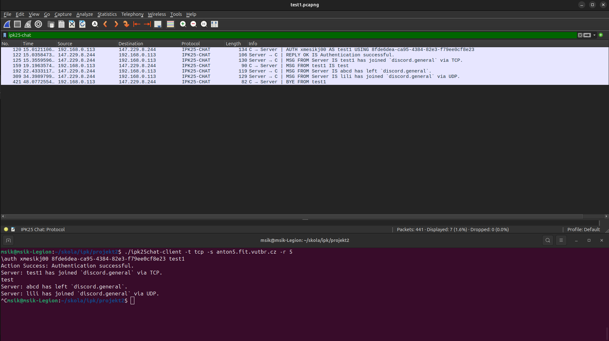
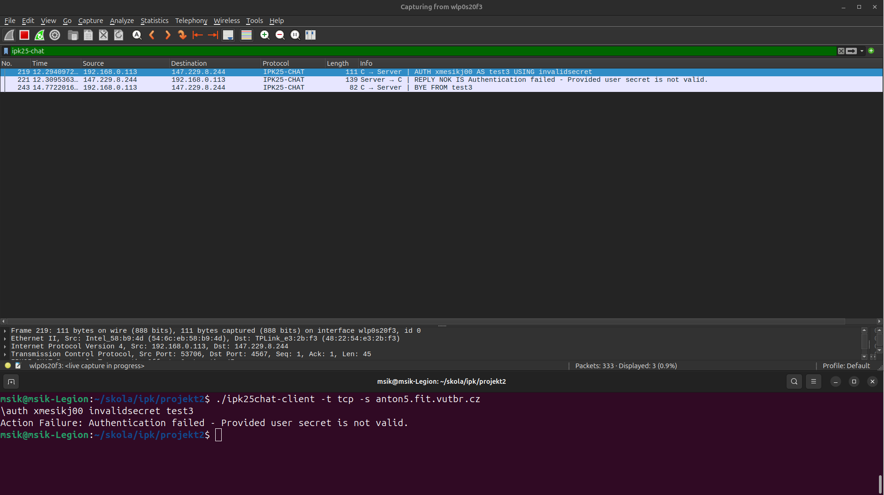
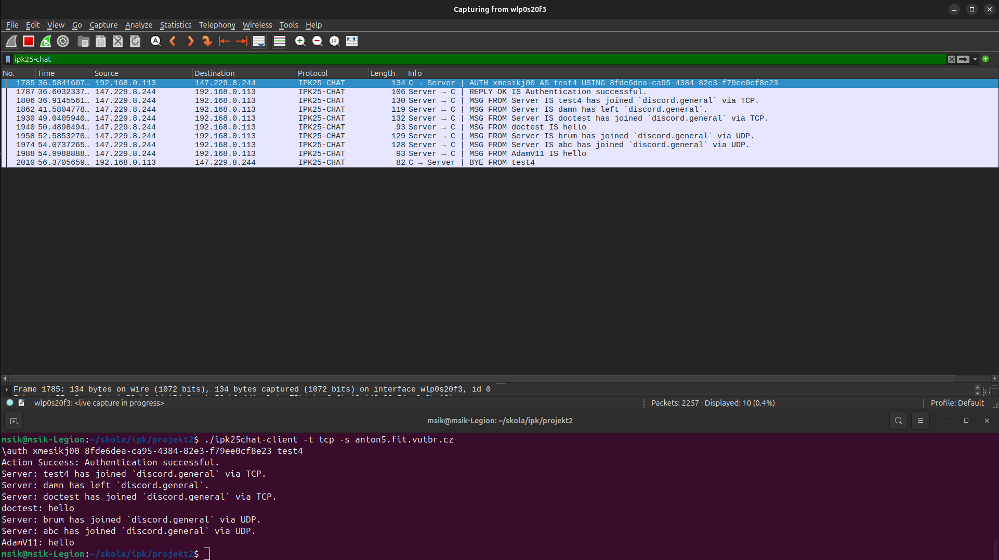
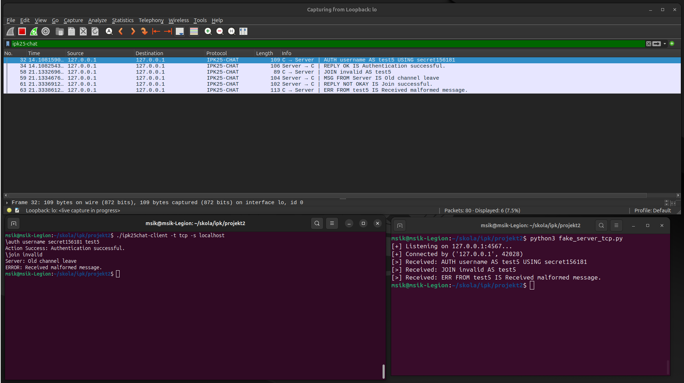
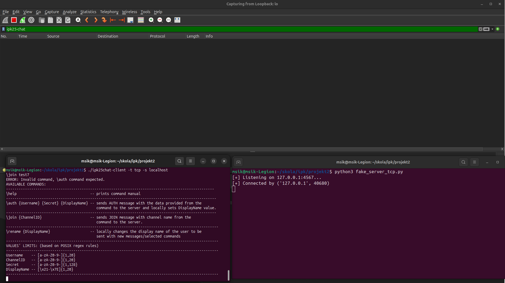

# Dokumentácia k 2. projektu IPK
- autor: Juraj Mesík
- login: xmesikj00

## Úvod

Program je implementáciou aplikácie, ktorá prostredníctvom abstraktného protokolu IPK25-CHAT **komunikuje s externým serverom**. Cieľom aplikácie je teda **poskytnutie rozhrania** pre takúto komunikáciu. Protokol **IPK25-CHAT je určený presnou štruktúrou zasielaných správ** a je abstrakciou pre dva základné protokoly - UDP a TCP. Aplikácia by mala na základe zvoleného protokolu zostaviť správu s odpovedajúcou štruktúrou, odoslať správu serveru a počkať na odpoveď, a zároveň **zaznamenávať aktivitu** na pripojenom externom serveri, až kým užívateľ neukončí spojenie znakom EOF alebo systémovým signálom SIGINT. Užívateľ prostredníctvom CLI argumetu `-t <udp | tcp>` určí, aký protokol bude základom pre komunikáciu. Okrem toho je nutné, aby užívateľ určil aj adresu cieľového servera cez `-s <ip address | hostname>`. Pre viac info viď. [CHANGELOG](./CHANGELOG.md).

## Architektúra

Program obsahuje zdrojové súbory (spolu s príslušnými hlavičkovými súbormi):
 - `ipk25chat-client.c` obsahuje `main` funkciu, ktorá spracúvava CLI argumenty a nastavuje niektoré hodnoty globálnych premenných
 - `chat_clients.c` obsahuje funkcie simulujúce stavy FSM automatu, hlavičkový súbor obsahuje štruktúru pre globálne premenné
 - `packets.c` obsahuje funkciu na posielanie a prijímanie packetov
 - `messages.c` obsahuje funkcie zodpovedné za konštrukciu správ podľa použitého protokolu, tieto funkcie zároveň kontrolujú správnosť prijatej správy
 - `utils.c` obsahuje funkcie na vypísanie pomocných správ na štandardný výstup a funkciu na kontrolu hodnôt vstupu


## Implementácia

Po spustení a načítaní argumentov funkcia prevedie adresu servera zo vstupu na reťazec IPv4 adresy, ktorý je vložený do globálnej premennej `ip_str`, s ktorou program až do konca pracuje. Následne je z `main` funkcie podľa zadaného protokolu zavolaná funkcia `tcpClient` alebo `udpClient`, ktoré simulujú počiatočný stav FSM.

### TCP varianta

Funkcia najprv vytvorí TCP socket pomocou `socket()` funkcie a štruktúru `destination`, ktorá obsahuje zadaný cieľový port a adresu servera. Pripojenie na server je uskutočnené funkciou `connect()`. Do štruktúry globálnych premenných sú pridané hodnoty socketu a používaný protokol.

Program zavolá funkciu `authState()`, ktorá implementuje správanie programu počas čakania na `\auth` príkaz od užívateľa podľa zadania. Predtým alokuje pamäť pre `username`(povolená dĺžka + '\0' = 21 bajtov), `displayname` (povolená dĺžka + '\0' = 21 bajtov) a `secret` (povolená dĺžka + '\0' = 129 bajtov). Taktiež vytvára pomocné buffery pre vytváranie správ a spracovanie prichádzajúcich packetov. While cyklus pomocou funkcie `select()` čaká na prichádzajúce správy na zadanom socket-e, a zároveň sníma štandardný vstup. Po úspešnom spracovaní a odoslaní príkazu `\auth` program skontroluje získané hodnoty pros. funkcie `isValid()` a zapíše získané hodnoty `username`, `displayname` a `secret` do štruktúry globálnych premenných a zavolá funkciu `openState()`. Pri neúspešnom príkaze `\auth` sú uvoľnené alokované položky a funkcia je rekurzívne zavolaná. Ak by v tomto stave prišiel na socket packet typu `BYE` alebo `ERR` (v programe je skontrolované prvé písmeno prichádzajúcej správy), vytvorí a vypíše sa správa `ERROR: ...` a program prejde do `endState()`, kde sa uzavrie otvorený socket a program skončí.

Vo funkcii `openState()` program čaká na vstup od užívateľa a zároveň sníma komunikáciu na sockete rovnakým spôsobom ako v `authState()`. Vstupom môžu byť príkazy `\join`, `\rename` alebo `\help`. V prípade, že je vstupom čokoľvek iné, bude to vyhodnotené ako regulérna správa `MSG` a cez funkciu `buildMsgTcp()` sa vytvorí TCP packet typu `MSG` a odošle sa serveru. Po prijatí správy typu MSG sa zavolá funkcia `buildIncomingtMsgTcp()`, ktorá do pripraveného bufferu vloží reťazec so štruktúrou prichádzajúcej správy (`{DisplayName}: {MessageContent}`). Po prijatí ERR sa predpokladá, že je zo servera, a teda, že musíme prejsť do konečného stavu. Predtým je na výstup vypísaná relevantná správa.

V `joinState()` by po prijatí správy typu `MSG` mal program ostať v tomto stave, až kým nedostane správu `REPLY`. Toto sa ale nedá vyriešiť rekurzívnym volaním `joinState()` (ako to bolo v auth stave), pretože by to znamenalo odoslanie novej identickej `JOIN` správy. Tento problém som vyriešil tak, že keď vo funkcii odošlem `JOIN` správu a zaznamenám odpoveď, vo while cykle, ktorý nasleduje, skontrolujem prvé písmeno odpovede. Ak sa jedna o `MSG`, na výstup sa vypíše adekvátna správa a znova sa zavolá `receivePacket()`. Ak je odpoveď typu REPLY (na tú čakáme), vypíše sa správa pomocou `buildActionStatusTcp()`, cyklus sa preruší a zavolá funkciu `openState()`. V prípade `ERR` správy sa vypíše relevantná správa na výstup, preruší sa cyklus a prejdem do konečného stavu `endState()`. Týmto zaručím, že mimo prípadu, kedy dostanem `REPLY` (úspech alebo neúspech) sa nepresuniem do `openState()`.

Funkcie v súbore `messages.c` taktiež zaručujú, že sa do predaného bufferu vložia aj `ERROR: ...\n` správy, ak nejaká správa neodpovedá pravidlám protokolu IPK25CHAT, čo v niektorých prípadoch znamená, že musíme odoslať na server `ERR` správu. V takýchto prípadoch v programe kontrolujem prvé písmeno naplneného bufferu, ak je to 'E' (čo by v inom prípade nemohlo nastať) odošle sa `ERR` packet a program prejde do konečného stavu. 
Teda ak napríklad pošlem serveru správnu `AUTH` správu a server mi pošle späť nesprávnu správu, funkcia `buildActionStatusTcp()` vloží do pomocného bufferu (ktorý je jej jediným argumentom) správu `ERROR: Received malformed message` - klasicky by to bola správa `REPLY`. Ja teda skontrolujem prvé písmeno - je to 'E' - pošlem `ERR` packet serveru. Podobne je ošetrené prijatie nesprávnych packetov aj v iných stavoch.

### UDP varianta

Funkcia simulujúca počiatočný stav vytvorí socket typu `SOCK_DGRAM` a štruktúru destination podobne ako v predošlej variante a inicializuje globálne premenné.  

Túto variantu sa mi podarilo implementovať iba pre stav `authState()`. Pre poslanie správy `\auth` sa cez volanie funkcie `buildAuthUdp()` do pomocného bufferu v  pomocou `memcpy()` vložia potrebné komponenty. Na začiatku funkcie vždy inicializujem hexadecimálnu reprezentáciu typu správy (0x02 pre `AUTH`) a index, ktorý používam na posúvanie sa po bytoch - po vložení adresy typu inkrementujem index o jedna, lebo typ má zaberať 1 byte, následne vložím adresu premennej `messageID` a inkrementujem index o dva, lebo ID správy by mal zaberať 2 byte-y a týmto spôsobom pokračujem ďalej.

Kvôli rôznym variantám som pridal do štruktúry globálnych premenných protokol, ktorý je určený na základe vstupu užívateľa argumentom `-t` . Túto hodnotu by som neskôr podobne ako v `authState()` používal na odlíšenie, ktorý typ správy by som vkladal do pomocného bufferu a tiež na odlíšenie správaní `sendPacket()` a `receivePacket()`, napr. aký typ správy sa očakáva.

Moje riešenie by taktiež zahrňovalo vytvorenie ďalších funkcii pre konštrukciu správ pre UDP packet, a to pravdepodobne `buildIncomingtMsgUdp()` na konštrukciu prichádzajúcej správy, `buildMsgTcp()` na konštrukciu UDP správy klienta, ktorá sa odošle serveru, `buildJoinUdp()` na konštrukciu správy, ktorá by požiadala o pripojenie sa na nejaký kanál. Taktiež by som mierne upravil funkcionalitu jednotlivých stavových funkcii tak, aby po každej prijatej správe klient odoslal správu CONFIRM a aby po každej odoslanej správe čakal na takúto správu. Pre odosielanie som implementoval funkciu `buildConfirm()`.

## Testy

#### Prostredie
```
GNU/Linux
#21~24.04.1-Ubuntu SMP PREEMPT_DYNAMIC Mon Feb 24 16:52:15 UTC 2
6.11.0-21-generic
x86_64
```
#### Osnova testov
1. krátky popis testu
2. použitý CLI príkaz + užívateľský vstup
3. obrázok výstupu wiresharku a konzoly + príloha daného .pcap súboru


### Test 1

**1.** 
Tento test demonštruje jednoduché pripojenie sa na referenčný discord server, odoslanie správy a ukončenie spojenia. Počas pripojenia je vidno, že program správne zaznamenáva aktivitu na servery. Na konci užívateľ ukončí spojenie pomocou SIGINT a odošle sa `BYE` packet. 

**2.** 
```
./ipk25chat-client -t tcp -s anton5.fit.vutbr.cz -r 5
\auth xmesikj00 8fde6dea-ca95-4384-82e3-f79ee0cf8e23 test1
test
^C

```

**3.** 
[test1 .pcap](./PCAPs/test1.pcapng)


___
### Test 2

**1.** 
Test obsahuje úspešné pripojenie na ref. server a pomocou `join` príkazu aj úspešnú zmenu kanálu. Užívateľ  pod svojím prvým menom odoslal správu `name1`, následne použil príkaz `\rename` a odoslal pod svojím novým menom správu `name2`. Program je ukončený znakom EOF.

**2.**
```
./ipk25chat-client -t tcp -s anton5.fit.vutbr.cz -r 
\auth xmesikj00 8fde6dea-ca95-4384-82e3-f79ee0cf8e23 test2
\join discord.jj
name1
\rename test22
name2
```
___
### Test 3

**1.** Neúspešne pripojenie na referenčný server - zo serveru prišla správa `NOK`, následne užívateľ ukončil spojenie cez SIGINT.

**2.** 
```
./ipk25chat-client -t tcp -s anton5.fit.vutbr.cz
\auth xmesikj00 invalidsecret test3
^C

```
**3.** 
[test3 .pcap](./PCAPs/test3.pcapng)


___
### Test 4

**1.** V tomto teste som sa snažil zaznamenať správy od iných používateľov a ich správne vypísanie na štandardnom výstupe. Ukončenie cez EOF.

**2.**
```
./ipk25chat-client -t tcp -s anton5.fit.vutbr.cz
\auth xmesikj00 8fde6dea-ca95-4384-82e3-f79ee0cf8e23 test4
```
**3.**
[test4 .pcap](./PCAPs/test4.pcapng)


___
### Test 5

**1.** V teste som použil vlastný server na localhoste, ktorý som nastavil tak, aby na príkaz `\join` poslal naspäť packet v nesprávnom formáte. Vidíme, ze program správne vyhodnotil, že sa jedna o chybu - vypísal `ERROR: ...` na výstup, poslal `ERR` packet s adekvátnou správou a spojenie ukončil.

**2.** príkazy konzole na obr. vľavo dole:
```
\./ipk25chat-client -t tcp -s localhost
\auth username secret156181 test5
\join invalid
```
**3.**
[test5 .pcap](./PCAPs/test5.pcapng)


___
### Test 6

**1.** Test ukazuje správanie programu pri zadaní nesprávneho `\auth` príkazu. Vidíme, že sa na výstup vypíše chybová hláška a napovedá, pričom sa neposiela žiadny packet ani sa nekončí spojenie.

**2.**
```
./ipk25chat-client -t tcp -s localhost
\auth test6 invalidauth
```
**3.**


___
### Test 7

**1.** Test ukazuje pokus o pripojenie sa do kanála pred autorizáciou užívateľa príkazom `\auth`. 

**2.**
```
./ipk25chat-client -t tcp -s localhost
\join test7
```
**3.**


___
## Zdroje
https://github.com/Vlad6422/VUT_IPK_CLIENT_TESTS.git - testy

https://www.geeksforgeeks.org/strtok-strtok_r-functions-c-examples/

https://man7.org/linux/man-pages/man2/select.2.html

https://man7.org/linux/man-pages/man2/connect.2.html

https://man7.org/linux/man-pages/man2/recv.2.html

https://www.w3schools.com/c/c_ref_string.php

https://chatgpt.com/ - využívanie hlavne na objasňovanie funkcii v C súvisiace s prácou s pamäťou a sieťovou komunikáciou aj s príkladmi, vďaka ktorým som  v programe použil už vlastnú interpretáciu daných funkcii  